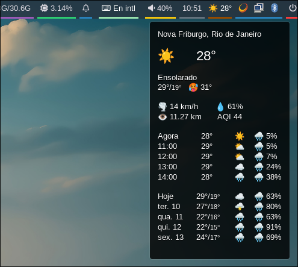
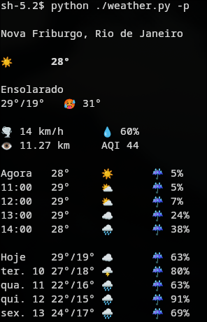

# Weather Forecast Library

## Overview

This library fetches and parses weather forecast data from Weather.com and formats it for display in various environments such as a terminal or Waybar, a status bar tool. It leverages `pyquery` for HTML parsing and provides detailed weather information, including hourly and daily predictions, formatted for ease of use.

### Waybar Widget



### Terminal Console



## Features

- Retrieves current weather and forecasts for a specified location.
- Displays weather data in different formats:
  - **Console output**: Richly formatted weather data with icons.
  - **Waybar JSON**: For integration with Waybar.
- Supports multiple languages for Weather.com data.
- Includes data such as:
  - Current temperature and "feels-like" temperature.
  - Wind speed, humidity, visibility, and air quality.
  - Hourly and daily forecasts with icons and precipitation chances.

## Requirements

- Python 3.8+
- Dependencies:
  - `pyquery`
  - `argparse`
  - `urllib`

Install dependencies using:

```bash
pip install weather-library
```

## Usage

### Command-Line Interface (CLI)

The library includes a CLI tool for fetching and displaying weather data. After installation, you can use the `weather` command.

#### Command-Line Arguments

- `--location`: Specify the 64-bit hex unique location ID for Weather.com. (Obtain from Weather.com URL for your location.)
- `--lang`: Specify the language for Weather.com data (e.g., `en-US`, `pt-BR`). If not specified, the language used will be the system default.
- `--output`: Choose between `console`, `waybar`, or `json`. Further explanation below. The default is `console`.
- `--persist`: Instead of executing and closing, keep the process running and retrieve new information from Weather.com every 10 minutes. Only makes sense when output is `console`.
- `--icons`: Specify the icon set for the output. Choose between `emoji` or `fa` for using `font-awesome` icons instead. The default is `emoji`.

#### Examples

1. **Fetch weather data for a specific location:**

   ```bash
   weather --lang en-IL --location WEATHER_LOCATION_ID
   ```

   The `WEATHER_LOCATION_ID` is a 64-bit hex unique location. To get the intended location, go to Weather.com, search for your location, and check the URL. The `LOCATION_ID` will be in the URL. Example:

   - For **São Paulo**, the URL is: `https://weather.com/pt-BR/weather/today/l/ebe93c0e09d0cfe19844d4281461901cd8f083c310e64255954758c8dcab784b`
   - The `WEATHER_LOCATION_ID` is `ebe93c0e09d0cfe19844d4281461901cd8f083c310e64255954758c8dcab784b`.

   Optionally, you can set the value as the environment variable `WEATHER_LOCATION_ID` and omit the `--location` parameter instead. If no environment variable nor parameter is specified, the weather data will be the default one from Weather.com.

2. **Display formatted weather in the console:**

   ```bash
   weather --lang en-US
   ```

   With the addition of the `--persist` option, the weather script will keep running and updating its information with new data every 10 minutes.

3. **Generate JSON for Waybar:**

   ```bash
   weather --output waybar --lang pt-BR --location WEATHER_LOCATION_ID
   ```

4. **Generate JSON output for general usage:**

   ```bash
   weather --output json --location WEATHER_LOCATION_ID | jq
   ```

### Output Formats

#### Console Output

The library displays a formatted weather summary, including:

- Current weather status.
- Temperature (current, max/min).
- Wind, humidity, visibility, and air quality.
- Hourly and daily forecasts with icons.

#### Waybar JSON

The JSON includes:

- `text`: Current weather icon and temperature.
- `alt`: Weather status.
- `tooltip`: Detailed weather information.
- `class`: Status code for further customization.

#### General JSON Output

The JSON output includes detailed weather data. Key fields include:

- `temperature`: An object containing the temperature information with the following fields:
  - `current`: The current temperature.
  - `feel`: The "feels-like" temperature.
  - `max`: The maximum temperature.
  - `min`: The minimum temperature.

Additional fields like `hourly_predictions` and `daily_predictions` contain lists of prediction information. Refer to the [JSON Schema](schema.json) for more details.

### Integration with Waybar

To integrate the library with Waybar:

1. Add a custom script module in Waybar's configuration:

   ```json
   {
       "modules-left": ["custom/weather"],
       "custom/weather": {
           "exec": "weather --output waybar",
           "interval": 600
       }
   }
   ```

2. Reload Waybar to apply the changes.

## Implementation Details

### Class Structure

- **`WeatherForecast`**: Represents weather data, including:
  - Current temperature and status.
  - Hourly and daily predictions.
- **`WeatherForecastExtractor`**: Parses HTML data from Weather.com to extract relevant weather information.

### Key Functions

- `grab_weather_data(lang, weather_id)`: Fetches HTML data from Weather.com.
- `get_weather_forecast(lang, weather_id)`: Extracts weather data and returns a `WeatherForecast` object.
- `format_weather(wf)`: Formats weather data for console display.
- `waybar(wf)`: Generates Waybar-compatible JSON.

### Customization

- The library uses `FontAwesome` and emoji-based icons. Customize these icons by editing the `weather_icons_fa` and `weather_icons_emoji` dictionaries.

## Installation

Install the library using pip:

```bash
pip install weather-library
```

## License

This library is open-source and available under the MIT License.